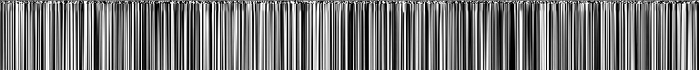
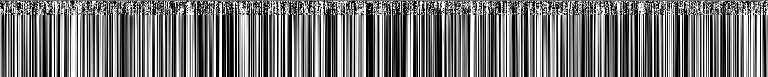
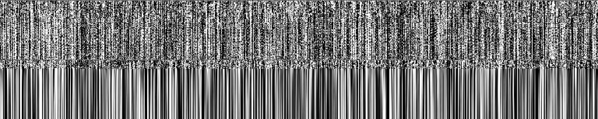

# これはなに

プロンプトから生成される embedding vector を可視化する [stable-diffusion-webui](https://github.com/AUTOMATIC1111/stable-diffusion-webui) の拡張です。

# 例

```
a cute girl
(3 tokens)
```



```
a cute school girl, school uniform, glasses, braid, black hair
(14 tokens)
```



```
(masterpiece:1),(blurry:1.3),(doll joints:1.5),best quality,8k wallpaper,(1 loli girl:1.1),(solo:1.15), (flat chest:1.2), (skinny:1.2), (ribs:1.2), (sundress:1.5), off shoulder,(light smile:1.2),(pale skin:1.5), (pale skin shade:1.1), (shiny oily skin:1.1), (intricate blond hair:1.2),(sky blue eyes:1.1),(squinting eyes:1.2),(empty eyes:1.4),(no pupils:1.2), (eyelashes:1.2),(red eye liner:1.1),Various hairstyles,(grasslands:1.1), (daytime,:1.2), invitation,dynamic angle,
(86 tokens)
```


